# About this project

> ## Mobile IELTS Listening Test System
>
> ---
>
> IELTS, is a system or an international standardization test of English language that tests proficiency for the non-native English speaker. One of
> the assessments of IELTS is the listening test. There exist paper-based tests and computer-based tests, the Mobile IELTS Listening Test
> System is to provide an additional option which is to allow English listening tests to be conducted using a mobile phone. In which could reduce
> the tools required, and further expand IELTS testing centers.

### Know more about this project [here](https://github.com/rockneverendz/BACS3403-Project/blob/master/Mobile%20IELTS%20Listening%20Test%20System%20Poster.pdf).

### This is a **backend server** of this project, also a **examiner portal** for the Mobile IELTS Listening Test System.

<br>

# Sample screenshots (Examiner Portal)

### Login Page

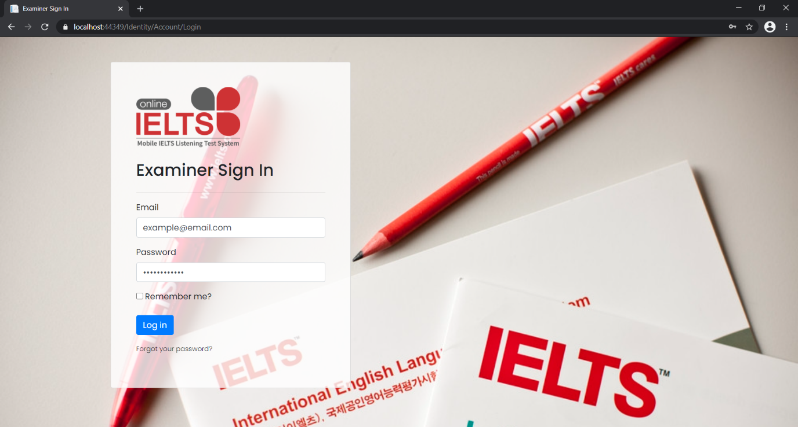
<br>
<br>

### Questions and Recordings

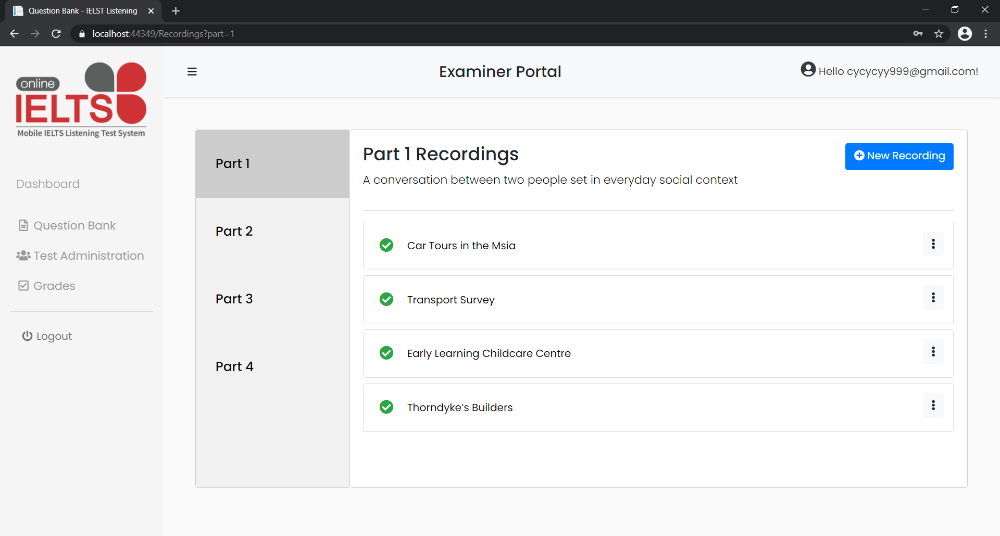
<br>
<br>

### Recording details

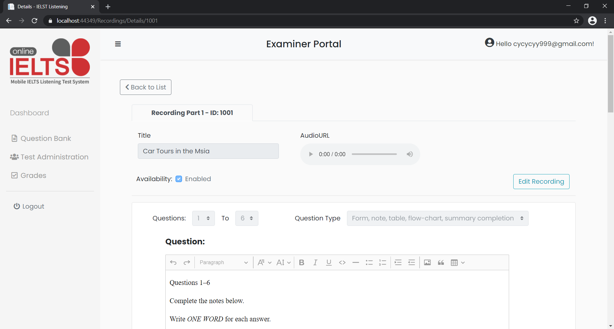
<br>
<br>

### Editing recordings

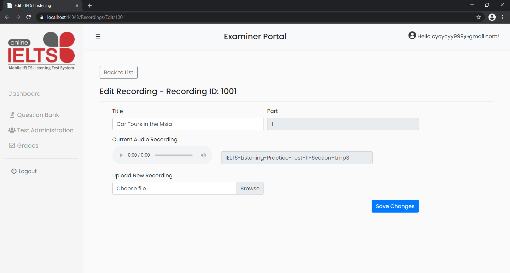
<br>
<br>

### Add New Recording

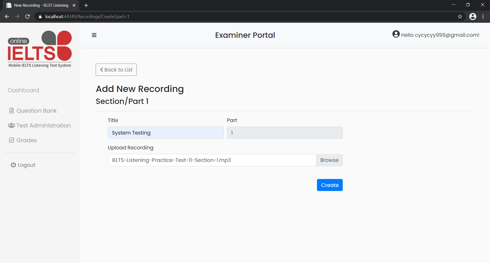
<br>
<br>

### Recording added

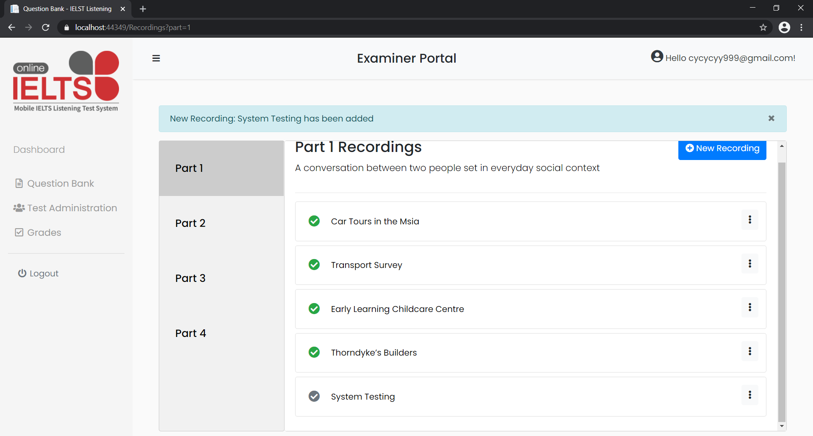
<br>
<br>

### Delete Recording

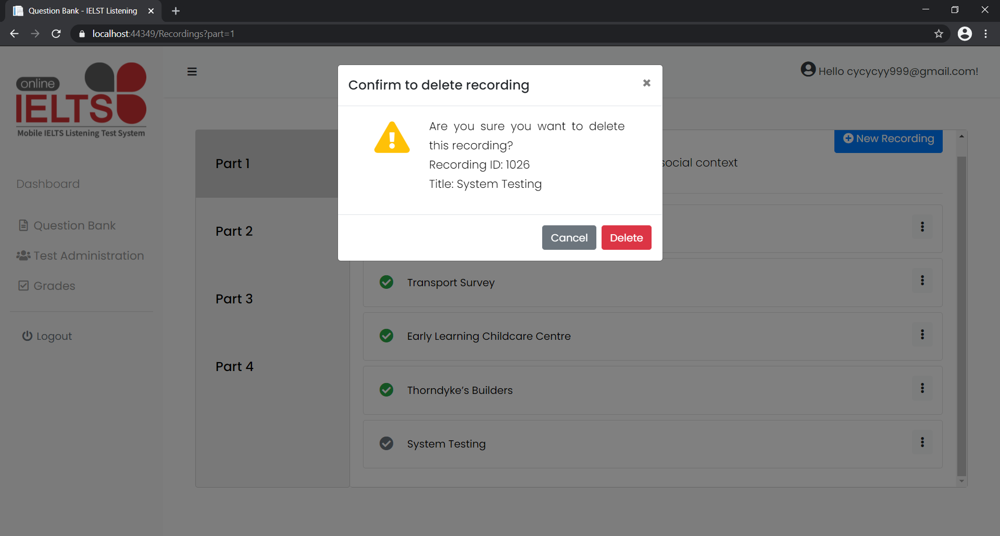
<br>
<br>

### Disable recording

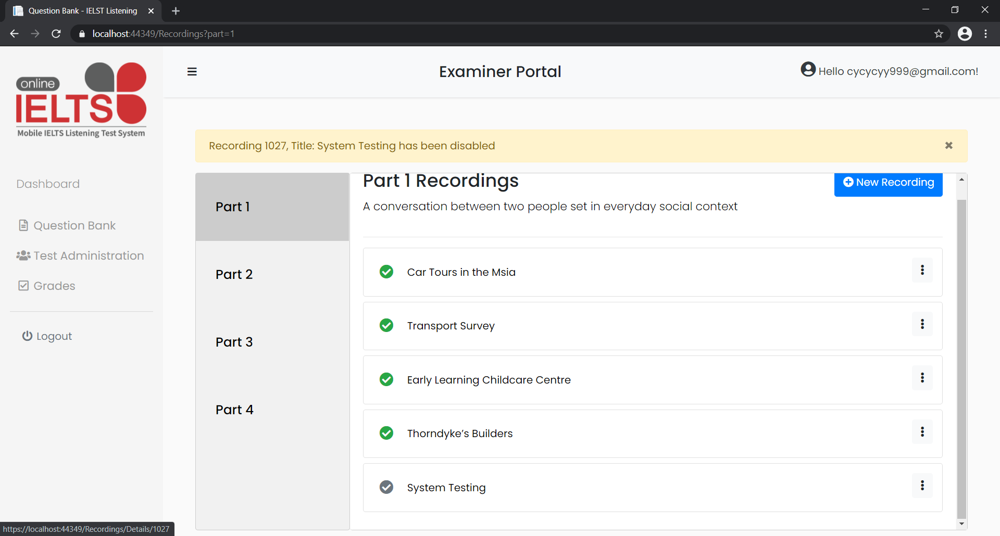
<br>
<br>

### Add new question group for recording

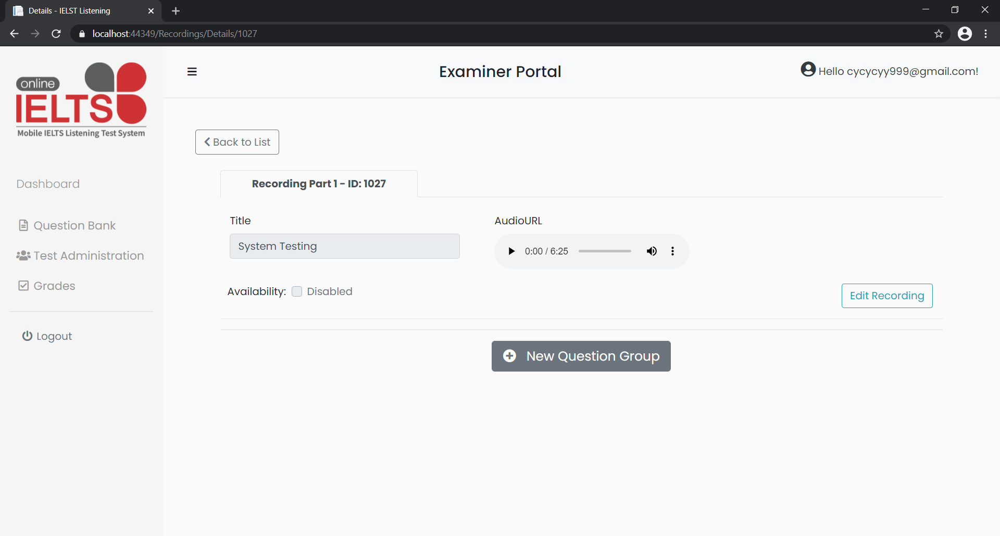
<br>
<br>
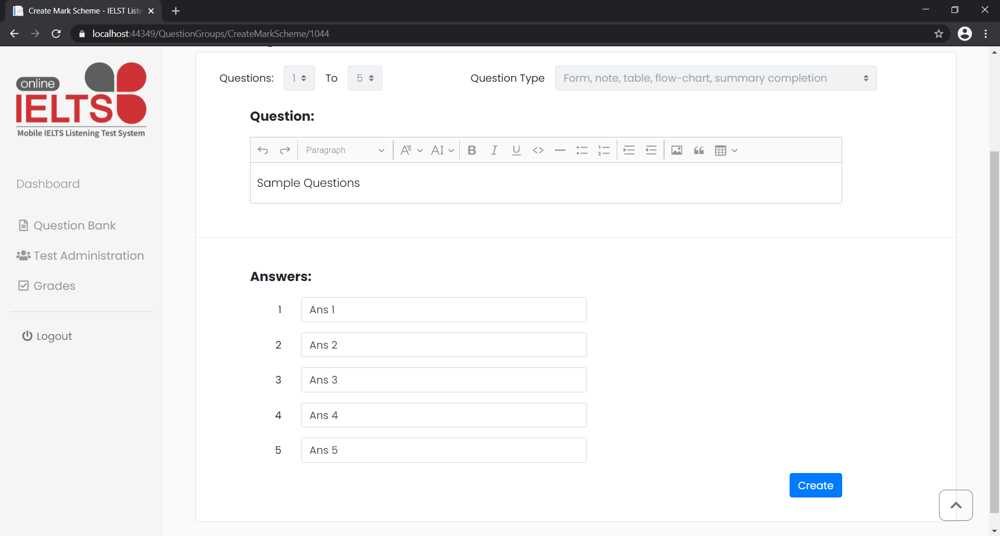
<br>
<br>
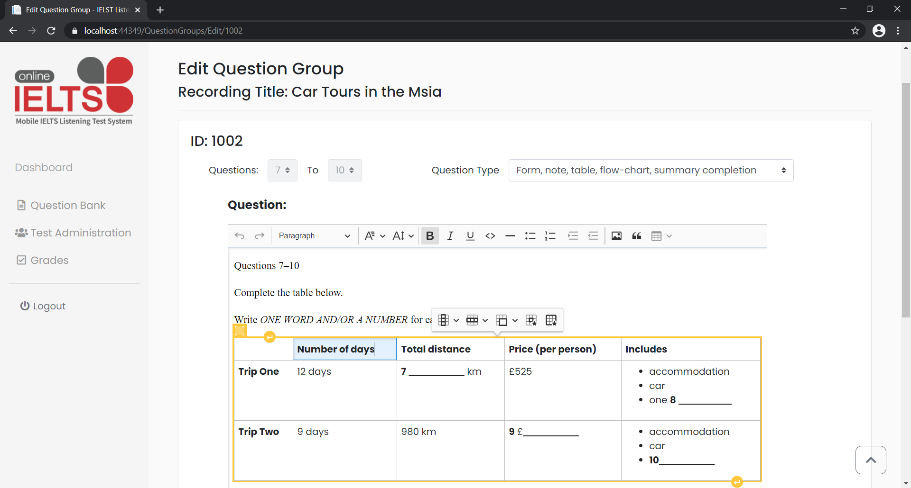
<br>
<br>

### Generate Seat Number

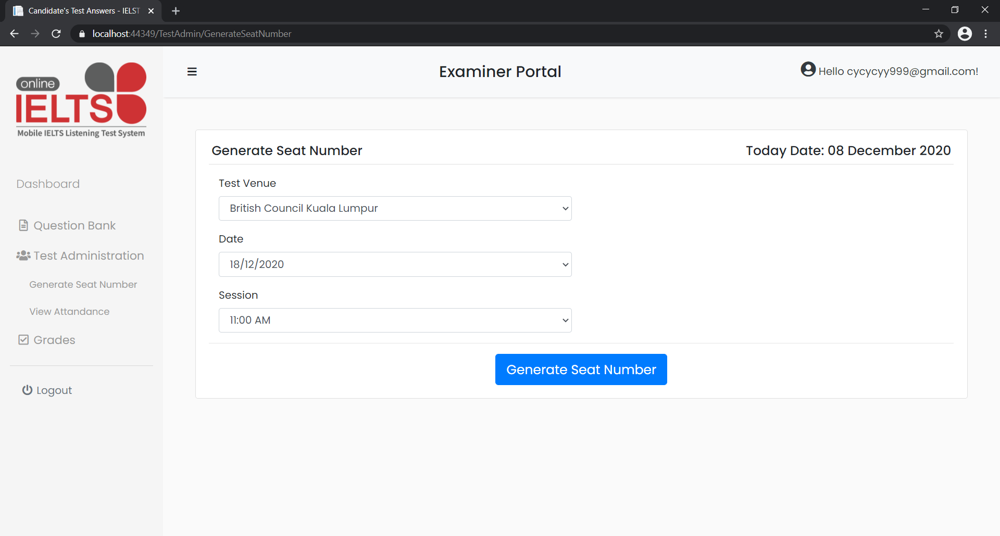
<br>
<br>
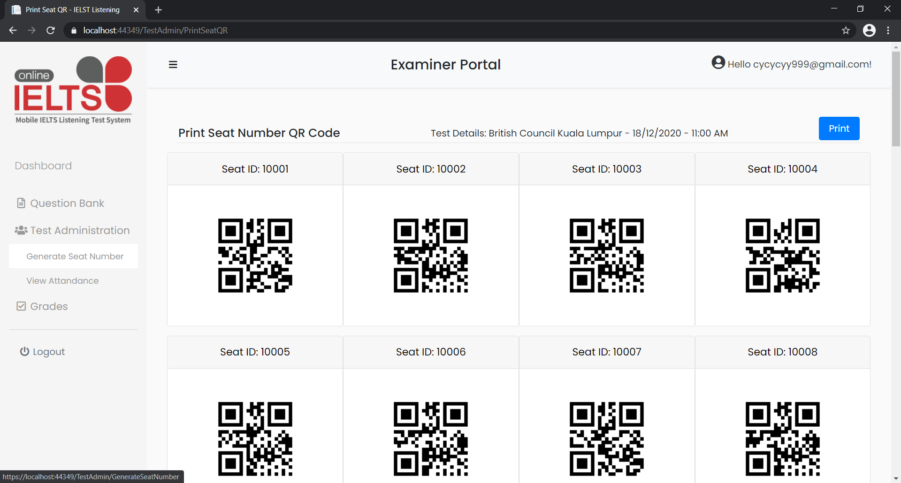
<br>
<br>

### View Attendance

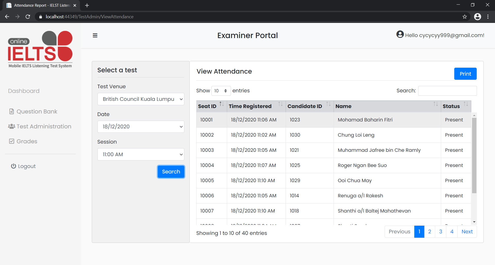
<br>
<br>

### Review Answers

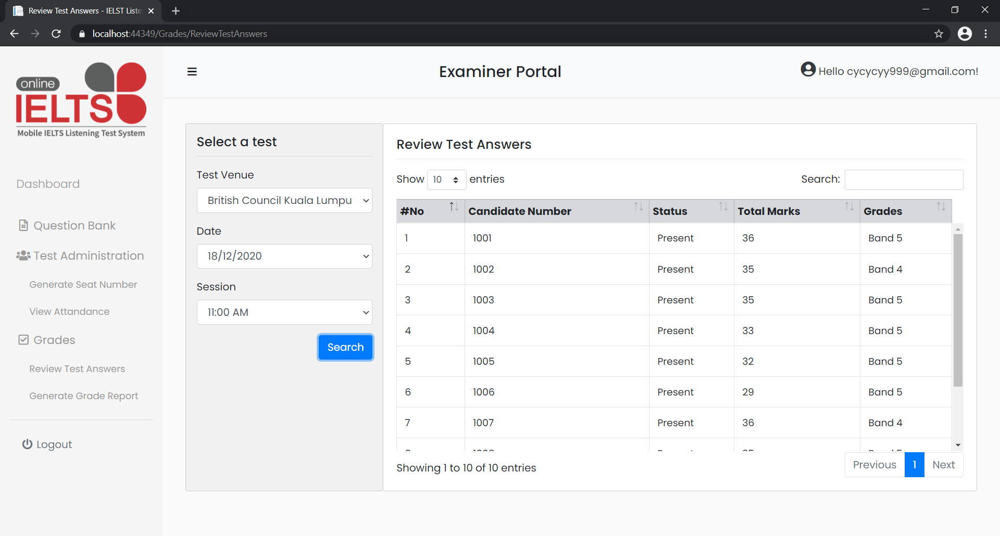
<br>
<br>
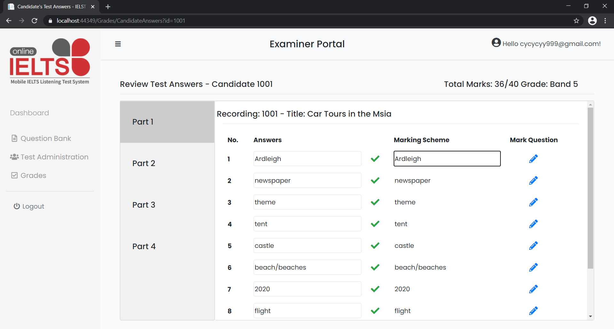
<br>
<br>

### Generate Grade Report

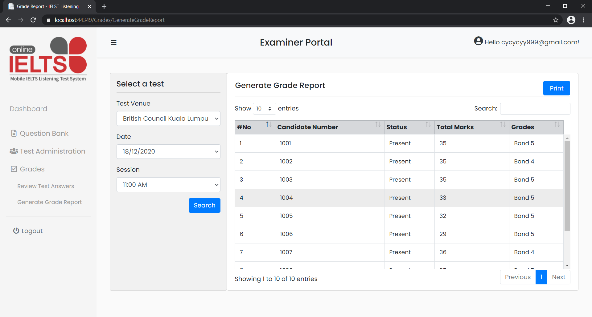
<br>
<br>

### Account Settings

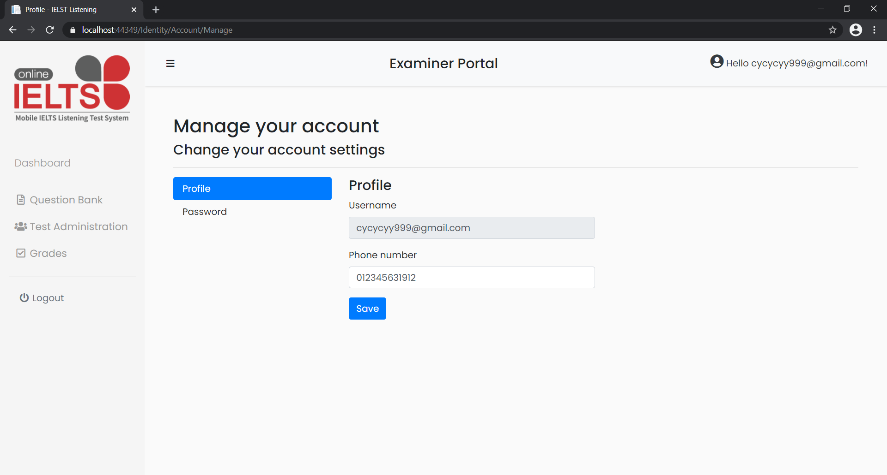
<br>
<br>


# Installation

## Software Requirement

-   IDE: Visual Studio 2019
-   Framework: .NET core 3.1 framwork

## Setup

1. Install Visuall Studio 2019.
2. Download the project as zip or clone using git.
3. Unzip the file and open the project using Visuall Studio 2019.
4. Open the project with `BACS3403-Project.sln` solution file.

## Migrate Database

1. Go to `Tools` > `NuGet Package Manager` > `Package Manager Console`.

2. Run the following command to drop the database if existed

```PowerShell
Drop-Database
```

3. Run the following command to create migration.

```
Add-Migration InitialCreate
Update-Database
```

4. Seed the database using `INSERT.sql`. Open the file select `connect` in to top bar menu. Select `Local` then `MSSQLLocalDB` and click `connect` to continue
   
5. From the dropdown list, select `BACS3403_Project`
   
6. Select `Execute` statement.
